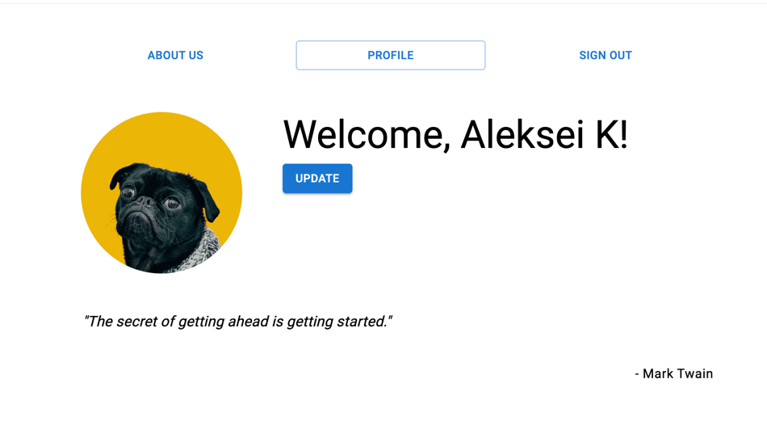

# Frontend Task Overview

### Тестовое задание на позицию frontend-разработчика.

Для выполнения задания использовались следующие технологии:

- ReactJS для создания пользовательского интерфейса
- TypeScript для типизации
- Mock Service Worker (MSW) для имитации бэкенда
- Jest и React Testing Library для тестирования

В ходе выполнения тестового задания был реализован функционал аутентификации и работы с профилем пользователя, а также
протестированы основные сценарии работы приложения. Все запросы были имитированы с использованием Mock Service Worker,
что позволило протестировать логику без реального бэкенда.

### API эндпоинты
- GET /info: Возвращает информацию о компании.
- POST /login: Аутентифицирует пользователя и возвращает токен. 
- GET /profile: Возвращает информацию о пользователе, используя токен. 
- GET /author: Возвращает данные об авторе (задержка 5 секунд). 
- GET /quote: Возвращает цитату от автора (задержка 5 секунд). 
- DELETE /logout: Завершается сессия пользователя.

